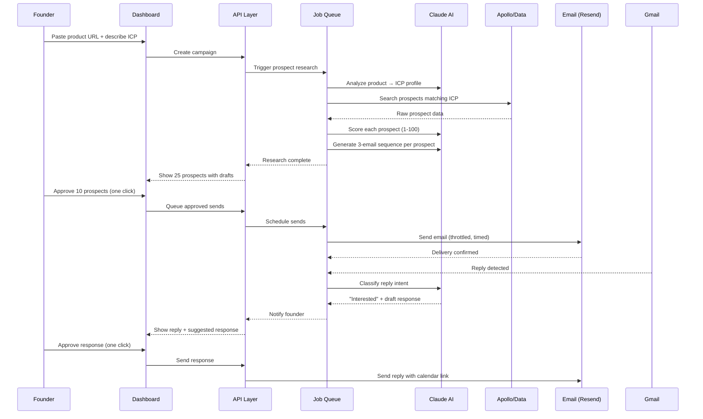

## Architecture Overview

```mermaid
graph TB
    subgraph Frontend["Frontend — Next.js 14 on Vercel ($20/mo)"]
        UI[Dashboard UI<br/>Tailwind + shadcn/ui]
        Auth[Auth Flow<br/>Google OAuth]
        Review[Email Review<br/>One-click approve]
    end

    subgraph Backend["Backend — Supabase ($25/mo)"]
        API[Next.js API Routes]
        DB[(Postgres<br/>Users, campaigns,<br/>prospects, emails)]
        AuthSvc[Supabase Auth]
        Realtime[Realtime<br/>Dashboard updates]
    end

    subgraph AI["AI Layer — Claude Sonnet 4.6"]
        ICP[ICP Analysis<br/>Product → persona]
        Score[Prospect Scoring<br/>1-100 + reasoning]
        Write[Email Generation<br/>Voice-matched]
        Classify[Reply Classification<br/>Intent detection]
    end

    subgraph Data["Data Providers"]
        Apollo[Apollo.io API<br/>Prospect + email data]
        LinkedIn[LinkedIn<br/>Proxied search]
        GitHub[GitHub API<br/>Dev tool companies]
        PH[Product Hunt<br/>Startup prospects]
    end

    subgraph Email["Email Infrastructure"]
        Resend[Resend<br/>Sending ($20/mo)]
        Gmail[Gmail OAuth<br/>Reply reading]
        Outlook[Outlook OAuth<br/>Reply reading]
        Domain[Cloudflare<br/>SPF/DKIM/DMARC]
    end

    subgraph Queue["Job Queue — Inngest ($25/mo)"]
        Research[Prospect Research<br/>Pipeline]
        Generate[Email Generation<br/>Pipeline]
        Send[Send Scheduling<br/>Pipeline]
        Reply[Reply Processing<br/>Pipeline]
    end

    UI --> API
    Auth --> AuthSvc
    API --> DB
    API --> Queue
    DB --> Realtime
    Realtime --> UI

    Research --> AI
    Research --> Data
    Generate --> AI
    Send --> Email
    Reply --> AI
    Reply --> Gmail
    Reply --> Outlook

    style Frontend fill:#064e3b,color:#fff
    style Backend fill:#064e3b,color:#fff
    style AI fill:#059669,color:#fff
    style Queue fill:#064e3b,color:#fff
```

## Data Flow



## Infrastructure Cost at Scale

| Scale | Infra | AI Costs | Data Costs | Total COGS | Gross Margin |
|-------|-------|----------|------------|-----------|-------------|
| Launch (10 customers) | $120/mo | $50/mo | $50/mo | ~$220/mo | ~50% |
| 100 customers | $500/mo | $4,000/mo | $3,000/mo | ~$10,500/mo | **77%** |
| 1,000 customers | $3,000/mo | $30,000/mo | $20,000/mo | ~$75,000/mo | **84%** |
| 10,000 customers | $15,000/mo | $200,000/mo | $150,000/mo | ~$630,000/mo | **88%** |
