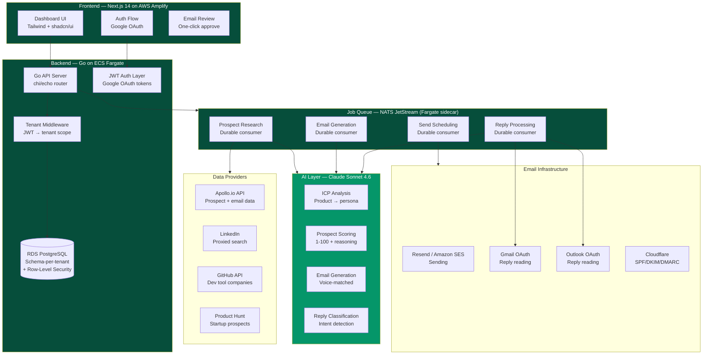
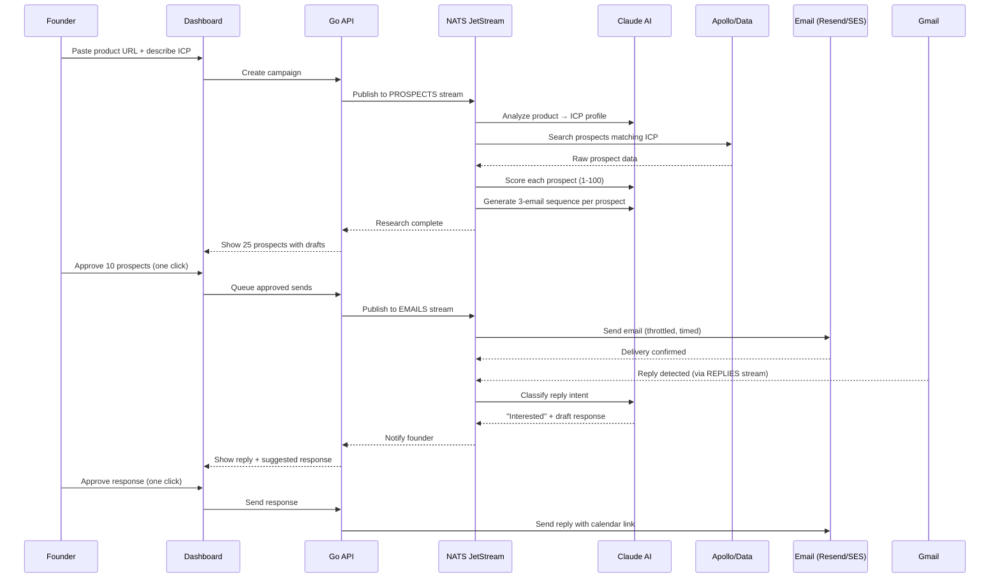

Here's how all the pieces fit together — the blueprint for how Spear works under the hood. From the dashboard you interact with, through the Go backend and NATS job queue, down to the email infrastructure that delivers your outreach.

## Architecture Overview

## Data Flow

## Infrastructure Cost at Scale

| Scale | Infra (AWS + services) | AI Costs | Data Costs | Total COGS | Gross Margin |
|-------|-------|----------|------------|-----------|-------------|
| Launch (10 customers) | $150/mo | $50/mo | $50/mo | ~$250/mo | ~45% |
| 100 customers | $600/mo | $4,000/mo | $3,000/mo | ~$10,600/mo | **76%** |
| 1,000 customers | $4,000/mo | $30,000/mo | $20,000/mo | ~$76,000/mo | **84%** |
| 10,000 customers | $20,000/mo | $200,000/mo | $150,000/mo | ~$635,000/mo | **88%** |
