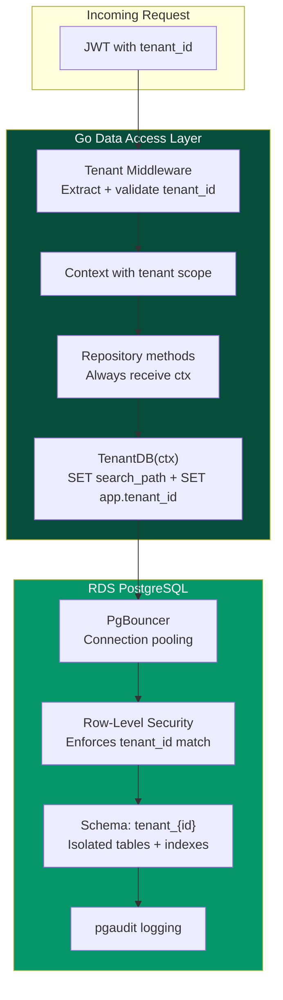
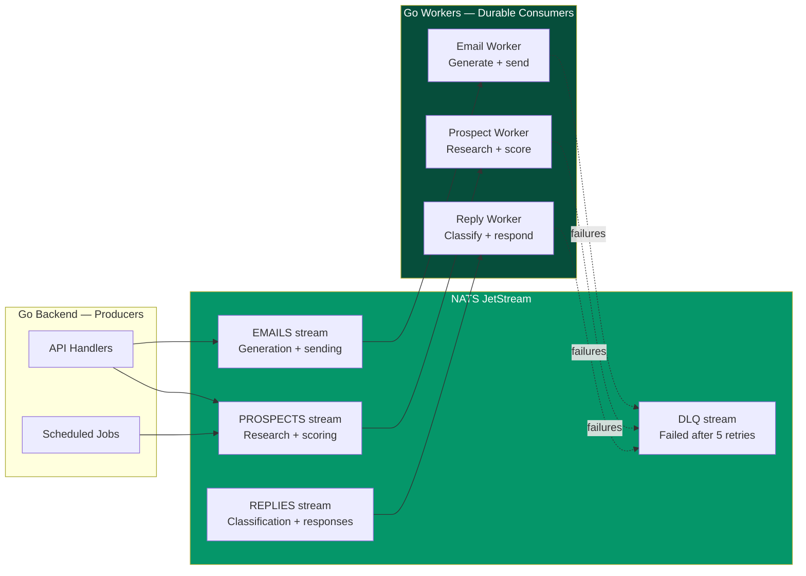

import { Card, CardGrid } from '@astrojs/starlight/components';

You don't need to be a developer to read this page. But if you are, you'll appreciate why every tool earned its spot. The guiding principle: minimize cost, maximize speed, and keep things production-ready from day one on AWS.

## Stack Overview

Every component was chosen to minimize cost, maximize development speed, and stay operationally simple for a solo technical founder — while running on AWS infrastructure you fully control.

| Component | Choice | Why | Monthly Cost |
|-----------|--------|-----|-------------|
| **Frontend** | Next.js 14 + Tailwind + shadcn/ui | Fast to build, server components for speed, great DX. Hosted on AWS Amplify or S3 + CloudFront. | ~$5-20 |
| **Backend API** | Go (Golang) | Fast, type-safe, compiles to a single binary. Runs on ECS Fargate — no servers to manage. Excellent concurrency model for handling async AI/email workflows. | ~$15-30 (Fargate) |
| **Database** | AWS RDS PostgreSQL (Multi-AZ) | Fully managed Postgres with automated backups, encryption at rest + in transit, and point-in-time recovery. Multi-tenant via schema-per-tenant with strict Row-Level Security. | ~$30-50 (db.t4g.micro/small) |
| **Auth** | Custom Go auth layer + Google OAuth | Lightweight JWT-based auth implemented in Go. No third-party auth dependency — full control over session management and tenant isolation. | Included in backend |
| **AI** | Claude Sonnet 4.6 API | Best cost/quality ratio for structured tasks. ~$0.003/1K input tokens | ~$200-500 at scale |
| **Job queue** | NATS JetStream | Durable messaging with at-least-once delivery, consumer groups, and replay. Runs as a sidecar on Fargate — lightweight, fast, and zero external dependencies. | Included in Fargate cost |
| **Email sending** | Resend (or Amazon SES) | Modern API, good deliverability, easy domain verification. SES as fallback for cost optimization at scale. | $20 (Resend) or ~$1/10K emails (SES) |
| **Email receiving** | Gmail/Outlook OAuth API | Read replies directly, no proxy needed | Free |
| **Prospect data** | Apollo.io API | Best price/quality for SMB prospect data. $0.03-0.05/enrichment | ~$100-300 at scale |
| **Domain mgmt** | Cloudflare | DNS + email routing for sending domains | Free-$5 |
| **Monitoring** | Sentry + PostHog | Error tracking + product analytics | Free tiers |
| **Secrets** | AWS Secrets Manager | Encrypted storage for API keys, DB credentials, OAuth tokens. Rotated automatically. | ~$2 |

## Multi-Tenant Database Architecture

Spear serves many customers from a single deployment, so tenant isolation is non-negotiable. We use a **schema-per-tenant** model on RDS PostgreSQL with multiple layers of safeguards.

### Database Layer Safeguards

| Safeguard | Implementation | What It Prevents |
|-----------|---------------|-----------------|
| **Schema-per-tenant** | Each tenant gets their own Postgres schema (`tenant_{id}`). Tables, indexes, and data are fully isolated. | Cross-tenant data leaks from shared tables |
| **Row-Level Security (RLS)** | RLS policies on every table enforce `current_setting('app.tenant_id') = tenant_id`. Even a buggy query can't return another tenant's rows. | Accidental cross-tenant reads/writes |
| **Dedicated DB roles** | Each tenant schema has a restricted Postgres role with `USAGE` and `SELECT/INSERT/UPDATE/DELETE` only on their schema. No access to `public` or other tenant schemas. | Privilege escalation between tenants |
| **Connection-level tenant binding** | Every connection sets `SET app.tenant_id = '{id}'` before executing any queries. RLS policies reference this session variable. | Queries running without tenant context |
| **Encrypted at rest + in transit** | RDS encryption enabled (AES-256). All connections require SSL (`sslmode=require`). | Data exposure from disk or network sniffing |
| **Automated backups + PITR** | Daily automated snapshots with 7-day retention. Point-in-time recovery to the second. | Data loss from bugs, bad migrations, or incidents |
| **Audit logging** | `pgaudit` extension logs all DDL and DML. CloudWatch Logs for long-term retention. | Unauthorized changes going undetected |

### Go Data Access Layer Safeguards

| Safeguard | Implementation | What It Prevents |
|-----------|---------------|-----------------|
| **Tenant-aware middleware** | Every HTTP request extracts tenant ID from the JWT and injects it into the request context. No tenant ID = request rejected. | Unauthenticated or tenant-ambiguous queries |
| **Scoped DB connections** | A `TenantDB(ctx)` helper returns a connection pre-configured with `SET app.tenant_id` and `SET search_path = tenant_{id}, shared`. All repository methods use this — never a raw pool connection. | Forgetting to set tenant context |
| **Compile-time tenant enforcement** | Repository interfaces require `context.Context` as the first parameter. The context carries the tenant ID. Linting rules flag any direct `db.Query()` calls that bypass the tenant-aware wrapper. | Developers accidentally querying without tenant scope |
| **Parameterized queries only** | All queries use `$1, $2` placeholders via `pgx`. No string interpolation, ever. SQL injection is structurally impossible. | SQL injection attacks |
| **Migration safety** | Schema migrations run per-tenant using `golang-migrate` with a tenant-aware wrapper. Migrations are tested against a staging tenant before rolling out. | Broken migrations corrupting tenant data |
| **Connection pooling** | PgBouncer in front of RDS in transaction mode. Limits total connections and prevents connection exhaustion from tenant spikes. | One tenant's traffic starving others |

## NATS JetStream — Durable Job Queue

All async work — prospect research, email generation, send scheduling, reply processing — flows through NATS JetStream with durable consumers.

| Design Decision | Implementation | Why |
|----------------|---------------|-----|
| **Durable consumers** | Named consumers with explicit ack. Messages re-deliver if not acknowledged within 30 seconds. | No lost jobs, even if a worker crashes mid-task |
| **Streams per domain** | Separate streams for `PROSPECTS`, `EMAILS`, `REPLIES`, `ANALYTICS`. Each has its own retention and consumer groups. | Clear separation of concerns, independent scaling |
| **At-least-once delivery** | `AckExplicit` policy with `MaxDeliver: 5` and exponential backoff. Dead-letter stream (`DLQ`) after 5 failures. | Guaranteed processing without infinite retry loops |
| **Tenant-tagged messages** | Every message header includes `Spear-Tenant-ID`. Consumers validate tenant context before processing. | Tenant isolation extends to the queue layer |
| **Replay capability** | Streams retain messages for 72 hours. Can replay from any sequence number for debugging or reprocessing. | Recover from bugs without data loss |
| **Lightweight deployment** | NATS runs as a sidecar container alongside the Go backend on Fargate. Single binary, ~20MB memory footprint. | No external queue service to manage or pay for |

## Cost Trajectory

<CardGrid>
  <Card title="At Launch" icon="rocket">
    **~$150/mo** total infrastructure. RDS micro + Fargate spot + Cloudflare + free tiers. Enough to serve first 10-20 customers while staying lean.
  </Card>

  <Card title="At 100 Customers" icon="star">
    **$8-15/mo marginal** per customer (AI calls + data enrichment). Total infra ~$3,500/mo. RDS scales to db.t4g.medium, Fargate adds workers.
  </Card>

  <Card title="At 1,000 Customers" icon="approve-check">
    **$5-10/mo marginal** per customer (volume discounts). Total infra ~$75,000/mo with 84% gross margin. Multi-AZ RDS, multiple Fargate tasks, NATS cluster.
  </Card>
</CardGrid>

## Why These Specific Choices

:::tip[Go over Node.js for the backend]
Go compiles to a single binary with zero runtime dependencies. It starts in milliseconds on Fargate, handles thousands of concurrent connections natively with goroutines, and has excellent libraries for Postgres (`pgx`), NATS (`nats.go`), and HTTP routing (`chi` or `echo`). For a system that juggles AI API calls, email sending, and database writes concurrently, Go's performance-per-dollar is unmatched.
:::

:::tip[RDS PostgreSQL over managed DBaaS platforms]
Running Postgres on RDS gives us full control over extensions (`pgaudit`, `pg_stat_statements`, `uuid-ossp`), schema-per-tenant isolation, Row-Level Security policies, and connection-level tenant binding — without managing the server itself. Automated backups, encryption, and Multi-AZ failover come out of the box. At $30-50/mo for a micro instance, it's cheaper than most managed Postgres offerings while giving us production-grade reliability.
:::

:::tip[NATS JetStream over SQS/Redis/Inngest]
NATS JetStream gives us durable messaging, consumer groups, replay, and dead-letter queues in a single ~20MB binary that runs alongside the app. No external service to configure, no network hops to a managed queue, and no per-message pricing. For async workflows like "research prospect → generate email → schedule send → classify reply," NATS streams with durable consumers are purpose-built. At scale, NATS clusters horizontally with zero configuration changes.
:::

:::tip[Claude Sonnet over GPT-4]
Claude Sonnet 4.6 offers the best cost/quality ratio for our specific use cases: prospect evaluation (structured reasoning), email writing (tone matching), and reply classification (nuanced understanding). At $0.003/1K input tokens, we can process a prospect for $0.02-0.05 all-in.
:::
