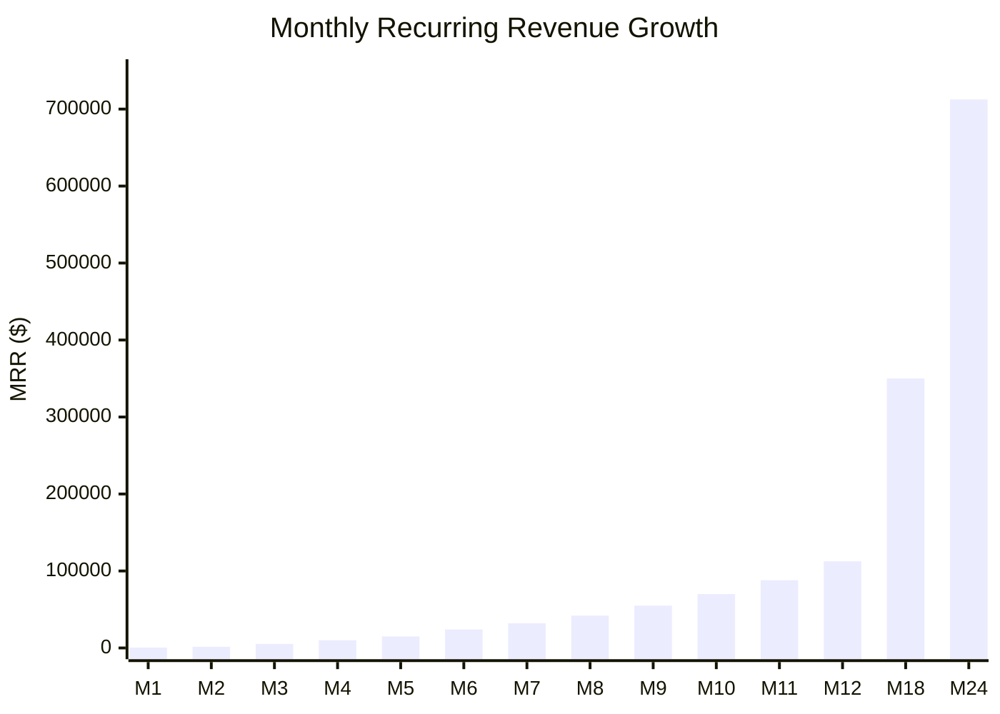
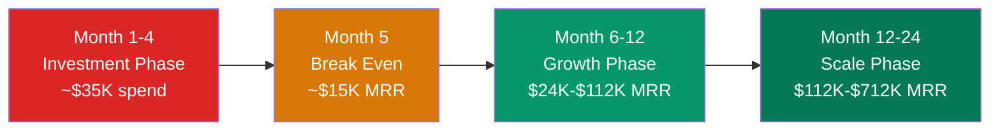

import { Badge } from '@astrojs/starlight/components';

## Revenue Trajectory

| Milestone | Customers | MRR | ARR | Cumulative Investment |
|-----------|:---------:|:---:|:---:|:--------------------:|
| **Month 3** | 15 | $5,250 | $63K | $35K |
| **Month 6** | 60 | $24,000 | $288K | $45K |
| **Month 12** | 250 | $112,500 | $1.35M | $45K (profitable from month 5) |
| **Month 24** | 1,500 | $712,500 | $8.55M | Self-funded from revenue |

## MRR Growth Visualization

## Key Assumptions

| Assumption | Value | Basis |
|-----------|-------|-------|
| Average revenue per customer | $450/mo (growing to $525/mo) | Mix of tiers + meeting bonuses |
| Monthly churn | 8-10% (improving to 7%) | Outbound takes time to deliver; once working, very sticky |
| New customer growth | 15-30% MoM early, 10-15% later | Community-driven acquisition + content flywheel |
| Profitable from | Month 5 | Low infrastructure costs + community-driven CAC |
| Total capital needed | ~$45K | Solo founder costs + infrastructure through profitability |

## Profitability Path

:::note[Conservative projections]
These projections assume moderate word-of-mouth effects. If the product delivers measurably (5-10 meetings/month), the community-driven distribution among vocal technical founders could accelerate growth significantly beyond these numbers.
:::

## What Drives Revenue Growth

1. **New customer acquisition** — community + content + referrals drive consistent new signups
2. **Improving retention** — as the AI improves, churn decreases from 10% to 7%
3. **Meeting bonus expansion** — better AI = more meetings per customer = more outcome revenue
4. **Tier upgrades** — customers who see results move from Starter to Growth to Scale
5. **Adjacent segment expansion** — agencies and larger SaaS companies from month 9+
