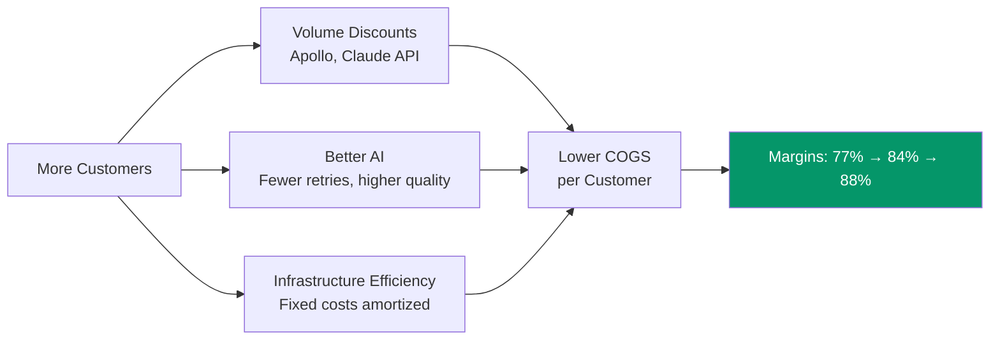

import { Badge } from '@astrojs/starlight/components';

Let's talk money. How much does it cost to serve a customer, how much do they pay, and does the math work? Spoiler: it works really well. For the non-finance folks: CAC is Customer Acquisition Cost (what we spend to get a customer), LTV is Lifetime Value (total revenue from a customer over their lifetime), and gross margin is the percentage of revenue left after covering direct costs.

## Unit Economics at Scale

| Metric | 100 Customers | 1,000 Customers | 10,000 Customers |
|--------|:------------:|:---------------:|:----------------:|
| **Avg revenue/customer** | $450/mo | $475/mo | $525/mo |
| **Monthly revenue** | $45,000 | $475,000 | $5,250,000 |
| **Infrastructure costs** | $3,500/mo | $25,000/mo | $150,000/mo |
| **Data enrichment** | $3,000/mo | $20,000/mo | $150,000/mo |
| **AI API costs** | $4,000/mo | $30,000/mo | $200,000/mo |
| **Total COGS** | $10,500/mo | $75,000/mo | $630,000/mo |
| **Gross margin** | **77%** | **84%** | **88%** |
| **CAC** | ~$150 | ~$300 | ~$500 |
| **Avg retention** | 10 months | 11 months | 13 months |
| **LTV** | $4,500 | $5,225 | $6,825 |
| **LTV:CAC** | **30:1** | **17:1** | **14:1** |

## Why Margins Improve at Scale

## Cost Per Customer Breakdown

### At 100 customers <Badge text="Month 6-9" variant="note" />

| Cost Category | Monthly | Per Customer |
|---------------|---------|-------------|
| Infrastructure (Vercel, Supabase, etc.) | $3,500 | $35 |
| Data enrichment (Apollo API) | $3,000 | $30 |
| AI API costs (Claude) | $4,000 | $40 |
| **Total COGS** | **$10,500** | **$105** |
| Avg revenue/customer | | $450 |
| **Gross profit/customer** | | **$345** |

### At 1,000 customers <Badge text="Month 12-18" variant="note" />

| Cost Category | Monthly | Per Customer |
|---------------|---------|-------------|
| Infrastructure | $25,000 | $25 |
| Data enrichment | $20,000 | $20 |
| AI API costs | $30,000 | $30 |
| **Total COGS** | **$75,000** | **$75** |
| Avg revenue/customer | | $475 |
| **Gross profit/customer** | | **$400** |

## CAC Analysis

| Timeframe | Primary Channels | CAC | Why |
|-----------|-----------------|-----|-----|
| Months 1-6 | Community, content, word-of-mouth | ~$150 | Near-zero paid acquisition |
| Months 6-12 | + Product Hunt, referrals, podcast appearances | ~$200 | Organic + some content costs |
| Months 12-18 | + Paid channels, partnerships | ~$300 | Scaling requires paid acquisition |
| Months 24+ | + Small sales team for Scale tier | ~$500 | Enterprise-adjacent accounts |

:::tip[The exceptional early LTV:CAC]
30:1 LTV:CAC at 100 customers is driven by near-zero acquisition cost from community-based distribution. This is the structural advantage of building for technical founders who actively share tools that work for them.
:::
