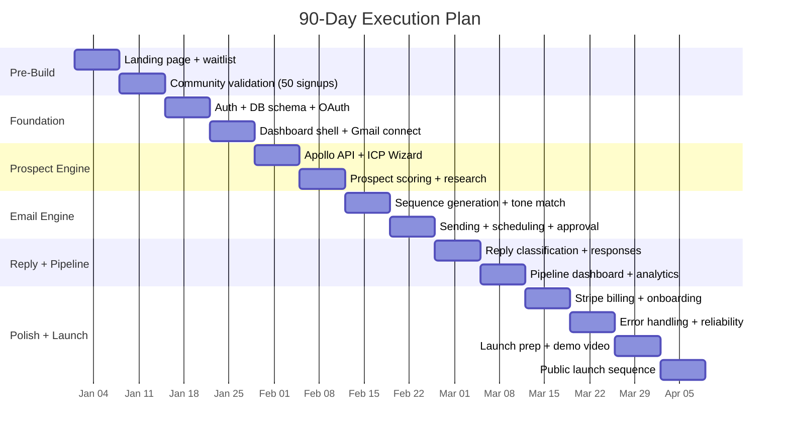

import { Badge, Steps } from '@astrojs/starlight/components';

## Resource Assumption

Solo technical founder, 60-70 hours/week dedicated. $30-40K available capital.

## Timeline Overview

## Week-by-Week Breakdown

### Pre-Build Phase (Week 0) <Badge text="Before Day 1" variant="note" />

<Steps>
1. **Set up infrastructure**: Supabase project, Vercel project, GitHub repo, domain
2. **Create landing page** with positioning, pricing, and waitlist signup
3. **Post in 3 communities** validating the pain (not pitching the product)
4. **Goal: 50 waitlist signups** before writing a line of product code
</Steps>

### Weeks 1-2: Foundation <Badge text="Build" variant="tip" />

**Build:** Auth flow (Google OAuth), database schema, Gmail/Calendar OAuth, basic dashboard shell.

**Validate:** Schedule 5 calls with waitlist signups — "Walk me through outbound today. What's the worst part? What would you pay?"

**Milestone:** Working auth, Gmail connected, database schema finalized.

### Weeks 3-4: Prospect Engine <Badge text="Build" variant="tip" />

**Build:** Apollo API integration, ICP Definition Wizard, prospect research pipeline, scoring model, prospect list UI.

**Decision gate:** Is prospect research quality good enough? Test with 5 waitlist users — "Would you email these people?"

**Milestone:** Input ICP → get 50 scored, researched prospects within 2 hours.

### Weeks 5-6: Email Generation <Badge text="Build" variant="tip" />

**Build:** Sequence generation, tone matching, subject line A/B variants, email preview UI, approval workflow, Resend API integration, send scheduling.

**Decision gate:** Send 100 test emails across 5 beta users. Target: >45% open rate, >5% reply rate, &lt;0.1% spam rate.

**Milestone:** Full flow: ICP → prospects → sequences → reviewed → sent.

### Weeks 7-8: Reply Management + Pipeline <Badge text="Build + Validate" variant="tip" />

**Build:** Reply classification, response generation, one-click approve, pipeline dashboard, meeting detection, basic analytics.

**Validate:** Onboard 5-10 beta customers (free). Run campaigns 2 weeks. Goal: at least 2 betas book at least 1 meeting each.

**Milestone:** End-to-end flow with real beta customers booking real meetings.

### Weeks 9-10: Polish + Billing <Badge text="Build" variant="tip" />

**Build:** Stripe billing, onboarding optimization (&lt;30 min to first prospects), weekly intelligence briefing, domain setup wizard, deliverability monitoring, error handling.

**Decision gate:** Can a new user go from signup to reviewing prospects in under 30 minutes with zero support?

**Milestone:** Product stable, billing works, onboarding smooth.

### Weeks 11-12: Launch <Badge text="Launch" variant="caution" />

**Build:** Landing page rewrite with testimonials, Product Hunt prep, demo video, documentation.

**Launch sequence:**
- Day 1: Soft launch to waitlist (500+ by now). 25% lifetime discount for first 20.
- Day 3-5: Indie Hackers post with real results
- Day 7: Twitter launch thread
- Day 10-14: Product Hunt launch
- Day 14+: Regular content cadence (2x/week blog, daily Twitter)

**Milestone:** 15+ paying customers, $5K+ MRR, product stable.
