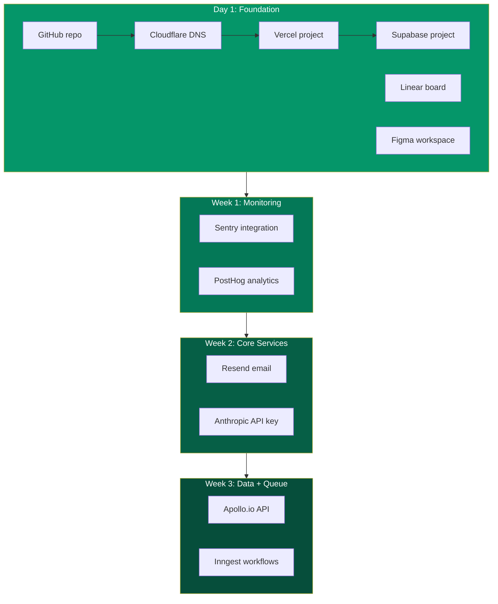

import { Badge } from '@astrojs/starlight/components';

## Infrastructure Table

| Tool | Purpose | Monthly Cost | Setup Priority |
|------|---------|:----------:|:--------------:|
| **GitHub** (private repo) | Version control | Free | <Badge text="Day 1" variant="tip" /> |
| **Vercel** | Frontend hosting + serverless | $20 | <Badge text="Day 1" variant="tip" /> |
| **Supabase** | Database, auth, edge functions | $25 | <Badge text="Day 1" variant="tip" /> |
| **Resend** | Transactional + outbound email | $20 | <Badge text="Week 2" variant="note" /> |
| **Anthropic API** (Claude) | AI backbone | ~$50 initially | <Badge text="Week 2" variant="note" /> |
| **Apollo.io API** | Prospect data | ~$50 initially | <Badge text="Week 3" variant="note" /> |
| **Inngest** | Job queue and scheduling | Free tier | <Badge text="Week 3" variant="note" /> |
| **Cloudflare** | DNS, domain management | Free | <Badge text="Day 1" variant="tip" /> |
| **Sentry** | Error monitoring | Free tier | <Badge text="Week 1" variant="tip" /> |
| **PostHog** | Product analytics | Free tier | <Badge text="Week 1" variant="tip" /> |
| **Linear** | Issue tracking | Free | <Badge text="Day 1" variant="tip" /> |
| **Figma** | Quick UI mockups | Free tier | <Badge text="Day 1" variant="tip" /> |
| **Total** | | **~$165/mo** | |

## Setup Order

## Cost Trajectory

| Phase | Monthly Cost | What's Active |
|-------|:-----------:|---------------|
| **Day 1** | ~$45 | GitHub, Vercel, Supabase, Cloudflare, free tiers |
| **Week 2** | ~$115 | + Resend, Anthropic API |
| **Week 3** | ~$165 | + Apollo, Inngest |
| **At 10 customers** | ~$220 | Increased AI/data usage |
| **At 100 customers** | ~$3,500 | Volume scaling |

:::tip[Total capital needed]
$30-40K covers everything through profitability (Month 5). This includes infrastructure costs, domain purchases, legal review budget, and the founder's living expenses. No external funding required.
:::
