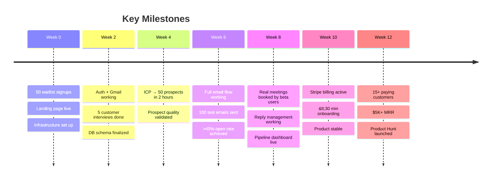

These are our moment-of-truth checkpoints. If the answer is wrong at any gate, we pivot — no ego, no sunk-cost thinking. The most dangerous thing a founder can do is keep building something nobody wants. Decision gates prevent that.

## Decision Gates

Decision gates are explicit go/no-go checkpoints that prevent building the wrong thing.

| Week | Gate | Question | Pass Criteria | Fail Action |
|:----:|------|----------|---------------|-------------|
| 0 | **Market validation** | Is the pain real? | 50 waitlist signups from 3 community posts | Pivot positioning or segment |
| 2 | **Customer conversations** | Do we understand the problem? | 5 calls confirm pain points + willingness to pay | Adjust ICP or value prop |
| 4 | **Prospect quality** | Would founders email these people? | 5 testers say "yes" to 80%+ of prospects | Improve scoring model |
| 6 | **Email quality** | Do emails perform? | >45% open rate, >5% reply rate, &lt;0.1% spam | Improve AI generation |
| 8 | **End-to-end validation** | Does it book meetings? | 2+ beta customers book 1+ meeting each | Identify and fix the bottleneck |
| 10 | **Onboarding** | Can users self-serve? | New user → first prospects in &lt;30 min, zero support | Simplify onboarding flow |

## Key Milestones

## Post-Launch Milestones (Weeks 13-16)

| Milestone | Target | Why It Matters |
|-----------|--------|----------------|
| Double down on working acquisition channel | Identify top channel by week 14 | Focus limited resources |
| Weekly customer calls (3-5/week) | Rapid feedback loop | Prevents building wrong features |
| Begin V2 feature planning | Based on actual usage data | Data-driven roadmap |
| First contractor hire | Part-time content writer | Outbound intelligence reports |
| Anonymous data aggregation pipeline | Foundation for cross-customer learning | Primary moat mechanism |

:::caution[The most important gate]
Week 8 is the critical decision point. If beta customers can't book meetings through the system, the core value prop is broken. Don't launch a product that doesn't deliver on its primary promise.
:::
