The "bowling pin strategy" is a classic startup concept: dominate one small, specific market first, then use that momentum to knock down adjacent markets — like a bowling ball hitting the lead pin. For Spear, the lead pin is B2B SaaS founders. Here's how we expand from there.

## The Bowling Pin Map

```mermaid
graph TD
    P1["🎳 Pin 1: B2B SaaS Founders<br/>1-15 employees<br/>Months 0-12"] --> P2["🎳 Pin 2: B2B Agencies<br/>& Consultancies<br/>Months 9-15"]
    P1 --> P3["🎳 Pin 3: Growing SaaS<br/>15-50 employees<br/>Months 12-18"]
    P2 --> P4["🎳 Pin 4: B2B Services<br/>Non-tech (accounting, legal)<br/>Months 18-24"]
    P3 --> P5["🎳 Pin 5: Mid-Market<br/>50-200 employees<br/>Months 24-36"]
    P4 --> P5
    P5 --> P6["🎳 Pin 6: Enterprise<br/>200+ employees<br/>Only if platform is mature"]

    style P1 fill:#059669,color:#fff
    style P2 fill:#047857,color:#fff
    style P3 fill:#047857,color:#fff
    style P4 fill:#065f46,color:#fff
    style P5 fill:#064e3b,color:#fff
    style P6 fill:#022c22,color:#fff
```

## Segment Expansion Details

| Phase | Segment | Why It's Adjacent | When | What Unlocks It |
|-------|---------|-------------------|------|----------------|
| **1** (current) | B2B SaaS founders, 1-15 emp | Beachhead — product built for them | Months 0-12 | V1 launch |
| **2** | B2B agencies + consultancies | Same outbound motion, similar size | Months 9-15 | Proven outbound engine, agency-specific ICP templates |
| **3** | Growing SaaS, 15-50 emp | Current customers who grew | Months 12-18 | V3 team features |
| **4** | Non-SaaS B2B services | Proven engine, adapt ICP intelligence | Months 18-24 | Vertical-specific templates |
| **5** | Mid-market, 50-200 emp | Full GTM platform by now | Months 24-36 | CRM + analytics + team features |
| **6** | Enterprise, 200+ | Only if/when platform is mature | Month 36+ | API + integrations + compliance |

## Why This Order Matters

Each pin "knocks down" the next by providing:

1. **Data**: Intelligence from SaaS founders improves outbound for agencies (similar B2B motions)
2. **Features**: Features built for growing customers serve the next size segment
3. **Credibility**: "Booked meetings for 5,000 founders" is a powerful positioning story for agencies and larger companies
4. **Revenue**: Each segment funds development for the next

:::caution[Discipline is critical]
Pin 2 is not pursued until Pin 1 is solidly established (100+ happy customers, strong retention, proven unit economics). Premature expansion is the #1 killer of focused startups.
:::

## The Endgame

At Pin 5 (mid-market, 50-200 employees), Spear has:
- A CRM with 2+ years of relationship data per customer
- Proven outbound intelligence across 5,000+ campaigns
- Full pipeline management + analytics
- Team collaboration features

This is where Spear starts competing with HubSpot — not feature-for-feature, but on the promise that **the AI actually runs your GTM instead of giving you a dashboard full of empty fields.**
