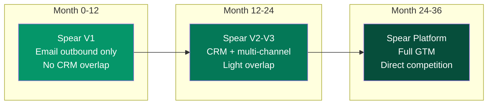

## When It Happens

The head-to-head competition with HubSpot begins at **Month 24-30**. By then, Spear has accumulated enough capability and data to serve as a full GTM platform.

## What Spear Has By Month 24

| Capability | Status |
|-----------|--------|
| CRM with 2+ years of relationship data per customer | Built from real interactions, not manual entry |
| Outbound intelligence across 5,000+ campaigns | Proprietary data asset |
| Full pipeline management + analytics | Revenue attribution included |
| Team collaboration features | Territory management, lead routing |
| Multi-channel outbound | Email + LinkedIn + retargeting |
| AI deal coaching | Call analysis + next-step suggestions |

## The Positioning Story

The competition with HubSpot isn't feature-for-feature. It's about the fundamental approach:

> "We started by booking meetings for 5,000 founders. Now we run their entire GTM."

Vs. HubSpot's pitch:

> "Here's a powerful platform. Now spend 40 hours configuring it, then 10 hours a week maintaining it."

:::tip[The real difference]
Spear does 80% of what HubSpot does, but the AI actually runs your GTM instead of giving you a dashboard full of empty fields. For companies under 200 employees, that 80% with AI operation beats 100% with manual operation every time.
:::

## The Transition Path

Spear customers at Month 24 don't need to "switch from HubSpot." They grew up with Spear:

1. Started with email outbound (Month 0)
2. CRM auto-populated from outbound activity (Month 6)
3. Pipeline management added naturally (Month 12)
4. Team features as they hired (Month 18)
5. Full GTM platform by the time they're 50+ employees (Month 24)

They never needed HubSpot in the first place.
