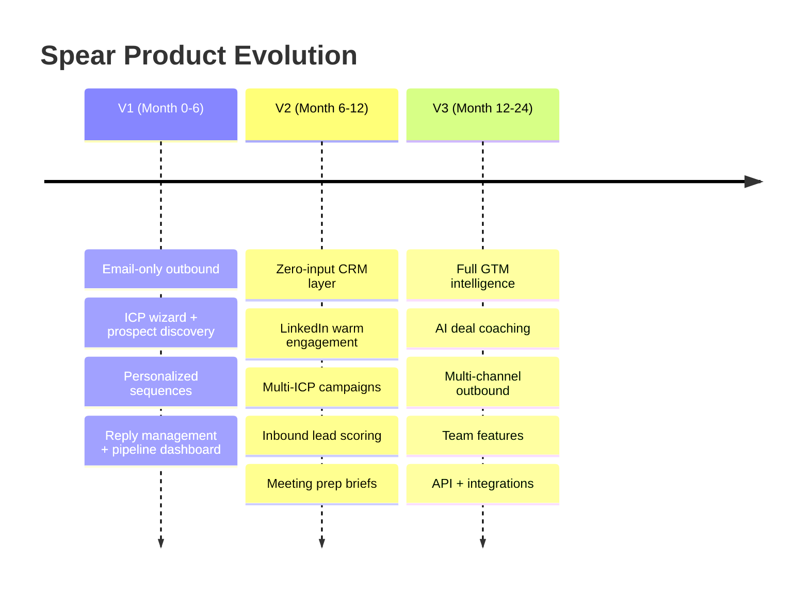

import { Badge, Card, CardGrid } from '@astrojs/starlight/components';

## V2 Features (Months 6-12) <Badge text="V2" variant="note" />

<CardGrid stagger>
  <Card title="Zero-Input CRM Layer" icon="document">
    Lightweight pipeline management that auto-populates from Spear's outbound activity + email/calendar sync. No data entry. Founder sees every interaction, deal stage, and next action in one view. **Begins the CRM lock-in moat.**
  </Card>

  <Card title="LinkedIn Warm Engagement" icon="star">
    AI identifies prospects posting on LinkedIn, drafts thoughtful comments and engagement suggestions. Founder executes manually (avoids LinkedIn TOS issues) but AI does 90% of the thinking. "Social selling co-pilot."
  </Card>

  <Card title="Multi-ICP Campaigns" icon="magnifier">
    Support for 2-3 distinct buyer personas. AI learns which ICP converts best and auto-allocates prospect budget across segments.
  </Card>

  <Card title="Inbound Lead Scoring" icon="information">
    Connect PostHog/GA to identify high-intent website visitors. When someone from a target account visits the pricing page, Spear auto-triggers contextual outreach.
  </Card>

  <Card title="Meeting Prep Briefs" icon="approve-check">
    Before every booked meeting: 1-page brief with prospect's likely pain points, relevant case studies, anticipated objections with responses, company research summary.
  </Card>
</CardGrid>

## V3 Features (Months 12-24) <Badge text="V3" variant="note" />

<CardGrid stagger>
  <Card title="Full GTM Intelligence Dashboard" icon="star">
    Revenue attribution (which campaigns drove actual revenue), pipeline forecasting, channel effectiveness comparison. Built on data already flowing through the system.
  </Card>

  <Card title="AI Deal Coaching" icon="information">
    After calls (via transcript integration with Fathom/Otter), AI analyzes what happened, identifies deal status, suggests next steps. "Gong for solo founders" at 1/50th the price.
  </Card>

  <Card title="Adjacent Outbound Channels" icon="rocket">
    Targeted LinkedIn/Meta ads for retargeting engaged prospects. Event-based outreach: monitor conferences, identify attendees matching ICP, trigger pre/post-event sequences.
  </Card>

  <Card title="Team Features" icon="approve-check">
    As customers grow to small sales teams (2-5 people): territory management, lead routing, team performance analytics.
  </Card>

  <Card title="API + Integrations Marketplace" icon="random">
    Open platform for customer-built integrations. Webhook system for custom workflows. Extensibility for power users.
  </Card>
</CardGrid>

## Evolution Timeline

