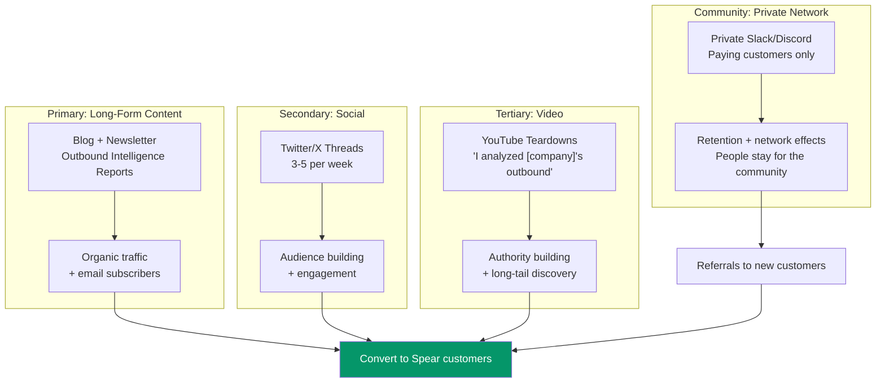

import { Card, CardGrid } from '@astrojs/starlight/components';

## Channel Strategy

## Channel Details

<CardGrid stagger>
  <Card title="Primary: Blog + Newsletter" icon="document">
    Long-form content sharing outbound intelligence. Weekly "Outbound Intelligence Report" with anonymized data: open rate benchmarks, subject line patterns, optimal send times. Becomes the authoritative source for SaaS founder outbound knowledge.
  </Card>

  <Card title="Secondary: Twitter/X" icon="star">
    3-5 threads per week with bite-sized outbound insights. Quick, actionable, shareable. Builds audience in the exact community where target customers congregate.
  </Card>

  <Card title="Tertiary: YouTube" icon="information">
    Teardowns: "I analyzed [public company]'s outbound motion. Here's what they're doing right and wrong." Long-tail discovery on YouTube drives consistent inbound interest.
  </Card>

  <Card title="Community: Private Slack/Discord" icon="approve-check">
    For paying customers only. Becomes a peer network for technical founders learning sales. **The community IS the moat** — people stay for the network even if the product had a rough week. Also drives referrals.
  </Card>
</CardGrid>

## Why Community-Driven Distribution Works

Technical SaaS founders are uniquely suited for community-driven acquisition:

| Characteristic | Impact |
|---------------|--------|
| **Highly connected** | Know 10-20 other founders personally |
| **Vocal online** | Active on Twitter, IH, HN, Reddit |
| **Metrics-driven** | Share tools that produce measurable results |
| **Community-oriented** | Attend MicroConf, join Slack groups, do mastermind sessions |
| **Trust-based decisions** | Peer recommendation > advertising |

:::tip[CAC approaches zero]
When a product delivers measurable results ($82/meeting) to a segment that loves sharing what works (SaaS Twitter, Indie Hackers), customer acquisition cost approaches zero. No amount of VC funding can buy this kind of authentic distribution.
:::
