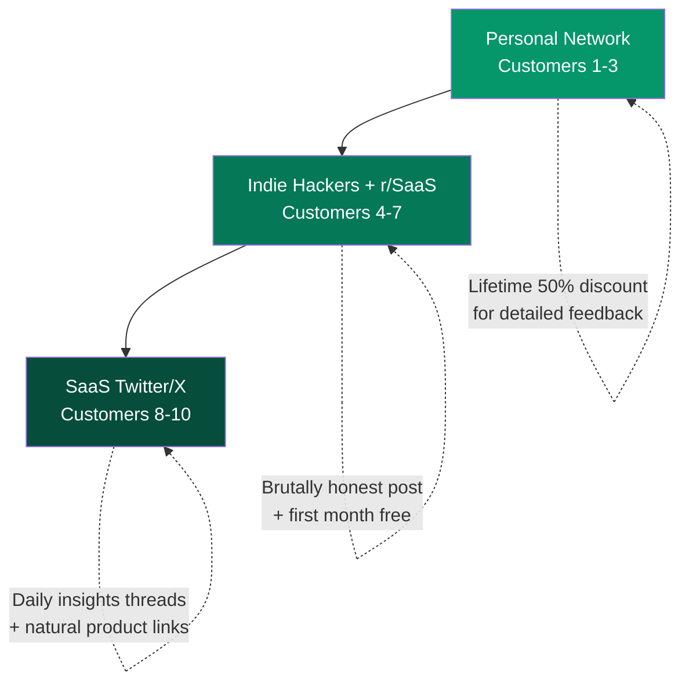

import { Card, CardGrid, Steps } from '@astrojs/starlight/components';

## The Strategy: No Ads, No Sales Team

The first 10 customers come from three channels, in sequence.

## Channel 1: Personal Network (Customers 1-3)

<Steps>
1. **Identify 3-5 technical founder friends** who actively need outbound help
2. **Offer lifetime 50% discount** in exchange for detailed feedback and testimonials
3. **These are alpha testers**, not just customers — their feedback shapes the product
4. **Goal:** 3 paying customers who provide weekly feedback
</Steps>

:::tip[Why this works]
Every technical founder knows 3-5 other technical founders who need outbound help. The warm introduction eliminates the trust barrier. The discount creates reciprocity and commitment to providing honest feedback.
:::

## Channel 2: Indie Hackers + r/SaaS (Customers 4-7)

**The play:** Write a brutally honest post.

**Title:** "I built an AI SDR because I was terrible at outbound. Here's what happened."

**Content format:**
- Show actual results (meetings booked, revenue generated) with screenshots
- Be transparent about what worked and what didn't
- Include real numbers — this segment LOVES building-in-public content
- Offer first-month free to 10 community members

**Why it works:** This segment values authenticity over polish. A founder sharing real results with real numbers generates more trust than any marketing page.

## Channel 3: SaaS Twitter/X (Customers 8-10)

**The play:** Daily threads sharing anonymized outbound insights.

**Content examples:**
- "We analyzed 500 cold emails to SaaS founders. Here's what gets replies."
- "The #1 mistake technical founders make in outbound (and the fix that got us 3x more meetings)"
- "Here's the exact email template that booked 7 meetings this week"

**Strategy:** Provide genuine value. Link to product naturally. The content IS the marketing. Build audience before asking for anything.

## Pre-Launch Validation

Before writing a single line of product code:

<Steps>
1. **Post in 3 communities** about the problem (not the product): "How do technical founders handle outbound? What's working?"
2. **Set up landing page** with positioning, pricing, and waitlist signup
3. **Goal: 50 waitlist signups** before building — validates that the pain is real
</Steps>
