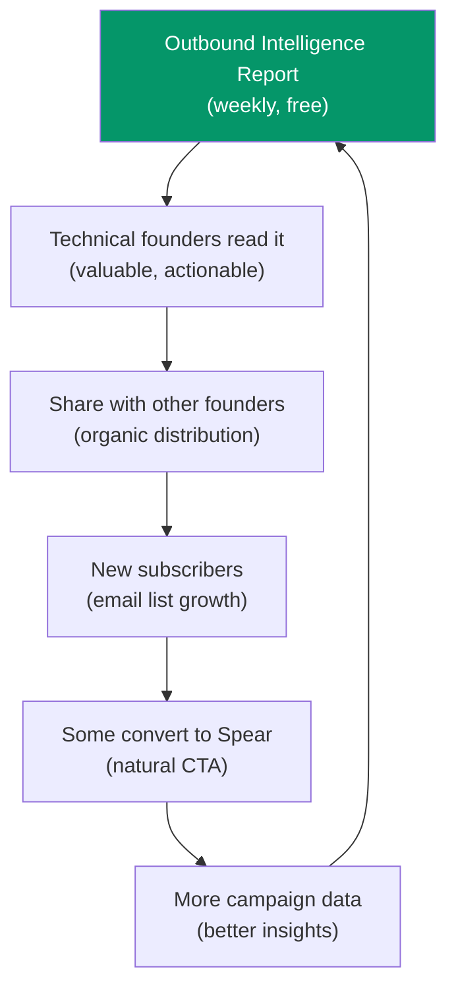

import { Card, CardGrid, Badge, Steps } from '@astrojs/starlight/components';

Getting from 10 to 100 customers is a different game than 0 to 10. The first ten came from hustle and personal relationships. The next ninety come from systems — content that compounds, a Product Hunt launch, referrals from happy customers, and strategic partnerships.

## Months 3-6: Five Growth Levers

<CardGrid stagger>
  <Card title="1. Content Flywheel" icon="document">
    Weekly "Outbound Intelligence Report" — anonymized, aggregated data on what's working in B2B SaaS outbound. Open rate benchmarks, best subject line patterns, optimal send times. **This becomes THE resource for technical founders doing outbound.** Every report drives signups.
  </Card>

  <Card title="2. Product Hunt Launch" icon="rocket">
    Timed for Month 3-4 after 50+ customers and solid metrics. Goal: **#1 Product of the Day.** Prep: build PH community relationships, compelling demo video showing the magic moment, coordinate upvotes from existing customers.
  </Card>

  <Card title="3. Integration Partnerships" icon="random">
    Build Stripe integration to auto-identify existing customers and reverse-engineer ICP. **Partner with Stripe Atlas** (50K+ companies, all SaaS founders, all need GTM). This is distribution gold.
  </Card>

  <Card title="4. Referral Program" icon="star">
    Existing customers get **1 month free** for every referral that converts. Technical founders talk to each other constantly. Word of mouth in tight-knit communities is the highest-quality acquisition channel.
  </Card>

  <Card title="5. Podcast + YouTube" icon="information">
    Target shows that technical founders actually watch: MicroConf, Indie Hackers podcast, My First Million, SaaStr founder stories. **Pitch:** "How I automated outbound and booked 200 meetings in 6 months for $300/mo."
  </Card>
</CardGrid>

## Product Hunt Launch Plan

<Steps>
1. **Month 1-2:** Build relationships with PH community. Upvote and comment on relevant launches.
2. **Month 3:** Prepare launch assets — demo video, screenshots, compelling copy showing real metrics from beta.
3. **Launch day:** Coordinate with 50+ existing customers for upvotes and genuine reviews.
4. **Post-launch:** Convert PH traffic to waitlist → free trial → paid.
5. **Target:** 500+ upvotes, #1 Product of the Day, 200+ signups in first week.
</Steps>

## The Content Flywheel Explained

The content flywheel is self-reinforcing: more customers generate more data, which produces better insights, which attract more customers. This is both a growth engine and a moat.

## Geographic Focus

| Phase | Market | Timing |
|-------|--------|--------|
| Phase 1 | US (largest SaaS market, best data coverage) | Months 0-9 |
| Phase 2 | UK + Canada (same language, similar ecosystem) | Months 6-12 |
| Phase 3 | Western Europe | Months 12-18 |
