Here's the concept in plain English: every email Spear sends teaches it something. Multiply that by hundreds of customers, and you get an AI that's dramatically better at outreach than anything a new competitor could build from scratch. It's a flywheel — more customers means better emails, which means happier customers, which means more customers.

## The Data Flywheel

```mermaid
graph TD
    A["📤 Emails Sent"] --> B["📊 Performance Data<br/>Opens, replies, meetings"]
    B --> C["🧠 AI Learns<br/>What works for which segments"]
    C --> D["✨ Better Outreach<br/>Higher conversion rates"]
    D --> E["😊 Happy Customers<br/>Lower churn, more referrals"]
    E --> F["📈 More Customers<br/>More data volume"]
    F --> A

    style C fill:#059669,color:#fff
```

## What the System Learns

Every email sent, every reply received, every meeting booked (or not) feeds understanding of:

| Signal | What It Teaches | How It Compounds |
|--------|----------------|-----------------|
| **Open rates** | Which subject lines work for which industries | Subject line generator improves across 50K+ data points |
| **Reply rates** | What personalization approaches convert | New customers get proven templates from day one |
| **Meeting rates** | Which prospect attributes predict conversion | Scoring model trains on real outcomes, not just firmographics |
| **Objection types** | What objections come up and how to handle them | Objection handling improves with every resolved thread |
| **Timing data** | When to send for maximum response | Optimal send times refined per industry/role |
| **Sequence position** | Which email in the sequence converts | Sequence structure optimized across all campaigns |

## The Compounding Timeline

## Why This Moat is Structural

:::caution[The key insight]
This is a **cross-customer data network effect**. Customer #500 gets dramatically better outreach than customer #1 because the system has learned from 499 prior campaigns across similar segments.

A new competitor starting from zero — even with unlimited funding — cannot replicate 12 months of compounding intelligence without 12 months of customers generating data.
:::

## The Intelligence Gap Over Time

| Metric | Month 1 (New Entrant) | Month 6 (Spear) | Month 12 (Spear) | Month 24 (Spear) |
|--------|----------------------|-----------------|------------------|------------------|
| Training campaigns | 0 | ~200 | ~1,000 | ~5,000 |
| Subject line data points | 0 | ~50K | ~250K | ~1.2M |
| Reply pattern library | 0 | ~2K | ~15K | ~80K |
| Prospect scoring accuracy | Baseline | +20% vs baseline | +45% vs baseline | +70% vs baseline |
| Average meetings/customer/mo | 3-5 | 5-8 | 7-10 | 8-12 |
