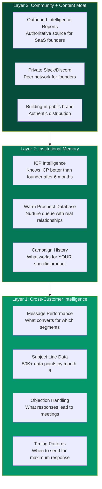

import { Card, CardGrid } from '@astrojs/starlight/components';

Every startup needs something competitors can't easily copy. Here's ours — and it gets stronger every single day. While most AI wrappers have zero defensibility, Spear builds three layers of moat that compound over time.

## The Moat Stack

Spear's defensibility isn't a single moat — it's three layers that compound over time.

## Why Each Layer Matters

<CardGrid stagger>
  <Card title="Cross-Customer Intelligence (Deepest)" icon="random">
    Every email, reply, and meeting across ALL customers feeds collective learning. This data is impossible to replicate without the same customer volume and time in market. See [Compounding Intelligence](/spear-gtm/moat/compounding-intelligence/).
  </Card>

  <Card title="Institutional Memory (Stickiest)" icon="star">
    After 3-6 months, Spear knows a founder's ICP better than the founder does. It has empirically tested which segments convert, which messaging resonates. **Switching means losing 6 months of accumulated intelligence — like firing an SDR who's been ramping.**
  </Card>

  <Card title="Community + Content (Widest)" icon="approve-check">
    The Outbound Intelligence Reports, private community, and building-in-public presence create distribution that reinforces the product. **People stay for the network even if the product had a rough week.**
  </Card>
</CardGrid>

## Second-Order Defensibility

1. **Content moat**: By publishing anonymized insights ("What we learned from 10,000 B2B SaaS outbound campaigns"), Spear becomes the authoritative source on outbound for technical founders. This content attracts the exact target segment.

2. **Warm prospect database**: Prospects who replied "not now" are in the nurture queue. This database of warm relationships has real value. Switching tools means abandoning in-flight conversations.

3. **ICP refinement**: The system continuously refines which prospect attributes predict conversion for each customer. This is trained on real outcome data, not just firmographics.
