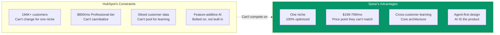

import { Card, CardGrid } from '@astrojs/starlight/components';

## The Inevitable Question

"Won't HubSpot just build this?" It's the first question anyone asks — and it's a fair one. HubSpot will absolutely ship an "AI prospecting" or "AI outbound" feature. Here's why it won't kill Spear.

## Four Structural Disadvantages

<CardGrid stagger>
  <Card title="1. Incentive Misalignment" icon="warning">
    HubSpot makes money selling **seats and tier upgrades**. An autonomous agent that replaces the need for multiple HubSpot users undermines their business model. They'll ship a "copilot" that assists users, not an agent that replaces the workflow. **They can't cannibalize their $800/mo Professional tier for a $300/mo agent.**
  </Card>

  <Card title="2. Architectural Constraint" icon="close">
    HubSpot's AI is **layered on top** of their existing data model and workflows. Spear is built **agent-first** — the AI IS the product, not an addon. HubSpot would need to rebuild their outbound stack from scratch to match the autonomous agent architecture.
  </Card>

  <Card title="3. Data Disadvantage" icon="information">
    HubSpot's data is **siloed per customer**. They won't pool customer outbound data for cross-customer learning (privacy concerns, enterprise customer resistance). Spear's model — where **anonymous aggregate learning is core** to the value prop — is architecturally different.
  </Card>

  <Card title="4. Focus Disadvantage" icon="magnifier">
    HubSpot serves **194K+ customers** across SMB to enterprise, marketing to service. Spear serves **one segment** (technical B2B SaaS founders) and optimizes exclusively for them. The AI's training data, prompts, templates, and intelligence are all tuned for this segment. HubSpot's broad focus means their AI will always be more generic.
  </Card>
</CardGrid>

## The Innovator's Dilemma in Action

## What They'll Actually Do

HubSpot will most likely:

1. **Ship an AI email writer** that helps users draft sequences within existing workflows (copilot, not agent)
2. **Add "AI scoring"** to their existing lead scoring, using per-customer data only
3. **Acquire an AI SDR startup** — but one targeting their mid-market+ segment, not SaaS founders

None of these threaten Spear because they don't address the core problem: **technical founders who don't want to use HubSpot's complex workflows at all**.

:::tip[The competition isn't feature-for-feature]
At Month 24+, Spear does 80% of what HubSpot does, but the AI actually runs your GTM instead of giving you a dashboard full of empty fields.

The positioning story: "We started by booking meetings for 5,000 founders. Now we run their entire GTM."
:::
