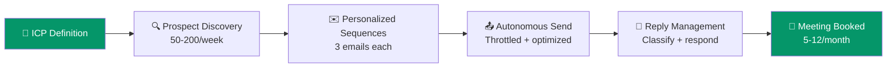

import { Card, CardGrid, Badge, Tabs, TabItem, Steps } from '@astrojs/starlight/components';

## The Pipeline Funnel

## Feature 1: ICP Definition Wizard <Badge text="V1 Core" variant="tip" />

The #1 blocker to effective outbound is that most founders can't articulate their ICP precisely. Spear solves this with AI-assisted ICP building.

**How it works:**
<Steps>
1. **Founder inputs** their product URL, existing customer list (even 3-5 names), and a verbal description of who they sell to
2. **AI analyzes** the product page, pricing page, and existing customers — scraping company data, firmographics, and patterns
3. **System outputs** a structured ICP profile with scoring criteria: company size, industry, tech stack, job titles, pain points
4. **Founder refines** the ICP with AI suggestions, then locks it in as the targeting filter
</Steps>

**AI specifics:** Claude/GPT-4 for product analysis (input: scraped product page + pricing page → output: value prop summary, target persona hypotheses). For existing customer analysis: LinkedIn + company website scraping → firmographic pattern matching → ICP scoring model.

## Feature 2: Prospect Discovery Engine <Badge text="V1 Core" variant="tip" />

Automated prospect finding based on ICP criteria, delivering 50-200 qualified prospects per week.

**Data sources:**
- LinkedIn (via proxied search)
- Apollo API for contact data + email finding
- GitHub (for dev tool companies)
- Product Hunt (for SaaS selling to startups)
- Job postings (hiring signals)

**AI specifics:** The LLM evaluates each prospect against ICP criteria. Input: prospect profile + company data + ICP definition. Output: relevance score 1-100 + reasoning + personalization hooks.

:::tip[This isn't keyword matching]
The AI understands nuanced fit: "This company just raised Series A and is hiring SDRs, which means they're scaling sales and likely need tooling." This contextual reasoning is what separates Spear from simple database filtering.
:::

## Feature 3: Hyper-Personalized Sequences <Badge text="V1 Core" variant="tip" />

For each prospect, AI generates a 3-email sequence with deep personalization.

<Tabs>
  <TabItem label="Email 1: Initial" icon="document">
    **Timing:** Day 1
    Personalization identifies the specific pain point this prospect likely has and connects it to the founder's product value prop. Goes beyond "I saw you {company_fact}."
  </TabItem>
  <TabItem label="Email 2: Follow-up" icon="document">
    **Timing:** Day 3
    Different angle, adds social proof or specific use case relevant to prospect's industry. Shorter, more direct.
  </TabItem>
  <TabItem label="Email 3: Breakup" icon="document">
    **Timing:** Day 7
    Final touch. Creates urgency without being pushy. Often the highest-converting email in the sequence.
  </TabItem>
</Tabs>

**Voice matching:** Analyzes the founder's existing emails and website copy to match their tone. Subject line optimization uses cross-customer performance data (anonymized).

## Feature 4: Autonomous Send + Reply Management <Badge text="V1 Core" variant="tip" />

Connects to Gmail/Outlook via OAuth and manages the entire sending and reply workflow.

**Sending:**
- Manages cadence (warm-up, throttling, send windows)
- Respects deliverability best practices
- Dedicated sending domains per customer with SPF/DKIM/DMARC

**Reply classification:**

| Reply Type | AI Action |
|-----------|-----------|
| **Interested** | Drafts response with meeting time (from calendar). Founder approves with one click. |
| **Objection** | Drafts objection-handling response. Founder reviews before send. |
| **Not now** | Adds to nurture queue with AI-determined follow-up timing. |
| **Unsubscribe** | Immediately removes. Compliance maintained. |
| **Out of office** | Reschedules follow-up for return date. |

**Trust ladder:** First 2 weeks, every email requires founder approval. Weeks 3-4, only first emails need approval. Month 2+, fully autonomous with notification.

## Feature 5: Pipeline Dashboard + Weekly Intelligence <Badge text="V1 Core" variant="tip" />

Closes the feedback loop with visibility and actionable insights.

- **Pipeline view:** Prospects → Contacted → Replied → Meeting Booked → Opportunity
- **Conversion metrics** at each stage
- **Weekly email digest:** "This week: 150 contacted, 12 replies, 3 meetings. Top theme: [X]. Suggested adjustments: [Y]."
- **A/B testing:** System automatically tests message variations and reports winners

:::caution[Why the dashboard matters more than you think]
Founders need to see ROI immediately. Without a clear feedback loop, they lose trust in the system. The dashboard isn't a nice-to-have — it's what prevents churn in the first 30 days.
:::
