import { Card, Badge, Steps } from '@astrojs/starlight/components';

## Signup to First Meeting

The magic moment is designed to happen within 2 weeks of signing up. Here's the exact user journey:

```mermaid
graph TD
    A["🔗 Sign Up<br/>Connect Google account"] --> B["📝 Paste Product URL<br/>+ describe ideal customer in 2 sentences"]
    B --> C["📧 Connect Email<br/>Gmail/Outlook OAuth"]
    C --> D["⏳ Wait 4 Hours<br/>AI researches prospects"]
    D --> E["👀 Review 25 Prospects<br/>With draft outreach ready"]
    E --> F["✅ Approve 10 with One Click<br/>Edit any you want"]
    F --> G["📤 First Emails Sent<br/>Next morning, respecting deliverability"]
    G --> H["💬 First Reply<br/>Within days"]
    H --> I["📅 First Meeting Booked<br/>Within 2 weeks"]
    style A fill:#059669,color:#fff
    style I fill:#059669,color:#fff
```

## The Step-by-Step Experience

<Steps>

1. **Sign up and connect your Google account** (2 minutes)
   One-click Google OAuth. We use this for email access and calendar availability.

2. **Paste your product URL and describe your ideal customer** (3 minutes)
   Just 2 sentences. Example: "We sell project management software to marketing agencies with 10-50 employees." The AI handles the rest.

3. **Connect your email** (1 minute)
   Gmail or Outlook via OAuth. Spear manages sending from your existing domain.

4. **Wait 4 hours** while the AI works
   Spear scrapes your product page, reverse-engineers your ICP, finds matching prospects, researches each one, and generates personalized email sequences.

5. **Review 25 researched prospects with draft outreach** (<15 minutes)
   Each prospect has: company summary, why they're a fit, personalization hooks, and a 3-email draft sequence. Approve, edit, or skip.

6. **Approve 10 with one click**
   Or edit any emails you want. The system learns your preferences.

7. **First emails hit inboxes the next morning**
   Sent at optimal times, throttled for deliverability, with proper authentication.

8. **First meeting booked within 2 weeks**
   When a prospect replies with interest, Spear drafts a response with your available meeting times. You approve with one click.

</Steps>

## The Feeling

:::tip[This is what we're building toward]
"I have an SDR working for me around the clock and it costs less than my Spotify + Netflix combined."

The founder went from "I spent 3 hours on LinkedIn and got zero responses" to having meetings appear on their calendar without lifting a finger.
:::

## Time Investment Comparison

| Activity | Manual Outbound | With Spear |
|----------|----------------|------------|
| ICP definition | 2-4 hours of research | 3 minutes of input |
| Prospect finding | 5-10 hours/week | Automated |
| Email writing | 5-8 hours/week | Review only (15 min/day) |
| Follow-up management | 2-3 hours/week | Automated |
| Reply handling | 1-2 hours/week | One-click approve |
| **Total/week** | **15-20 hours** | **<1 hour** |
