import { Card, CardGrid, Badge } from '@astrojs/starlight/components';

## The Ideal Customer Profile

```mermaid
graph TD
    A[All B2B Companies] --> B[B2B SaaS Only]
    B --> C[1-15 Employees]
    C --> D["$0-2M ARR"]
    D --> E[Technical Founder/Co-founder]
    E --> F[Has Working Product]
    F --> G[English-Speaking Markets]
    G --> H["🎯 Spear's ICP<br/>~50,000-100,000 companies"]
    style H fill:#059669,color:#fff
```

## Demographic Profile

| Attribute | Detail |
|-----------|--------|
| **Role** | Founder or co-founder (usually technical — engineer, product person) |
| **Company size** | 1-15 employees |
| **Revenue** | $0-$2M ARR |
| **Stage** | Has a working product with some customers (past idea stage) |
| **Geography** | US, UK, Canada, Western Europe (English-speaking markets first) |
| **Budget** | Currently spending $0-500/mo on GTM tools |
| **Willingness to pay** | $200-500/mo for something that demonstrably works |

## Current Tool Stack

The typical Spear customer is using some combination of:
- LinkedIn Sales Navigator ($80/mo)
- Apollo free tier
- HubSpot free CRM
- Google Sheets for pipeline tracking
- Manually writing emails

**Total spend: $0-500/mo. Total time: 15-20 hrs/week. Total results: inconsistent.**

## Psychographic Profile

<CardGrid>
  <Card title="Values" icon="approve-check">
    Efficiency, technical quality, demonstrated results. Skeptical of "AI hype" but willing to try things that demonstrably work. Respects products built by other technical founders.
  </Card>

  <Card title="Community" icon="star">
    Active in indie hacker/SaaS Twitter communities. Reads SaaStr, Lenny's Newsletter. Hangs out on Indie Hackers, r/SaaS, Hacker News. Goes to MicroConf.
  </Card>

  <Card title="Frustrations" icon="warning">
    Knows they need outbound but keeps procrastinating. Has exhausted warm network. Tried manual outbound with poor results. Feels like a fraud when doing sales.
  </Card>

  <Card title="Decision Making" icon="information">
    ROI-driven. If shown 5-10 meetings/month for $300/mo, the math is trivial. Needs to see results within 2 weeks or churns. Will tell 10 other founders if it works.
  </Card>
</CardGrid>

:::note[Why this segment is perfect for bootstrapping]
This segment is **price-sensitive but ROI-driven**, congregates in **identifiable communities** (free distribution), is **highly vocal** (word-of-mouth amplification), and has **low expectations** for enterprise features (fast time to market). Every attribute aligns with a bootstrapped go-to-market motion.
:::
