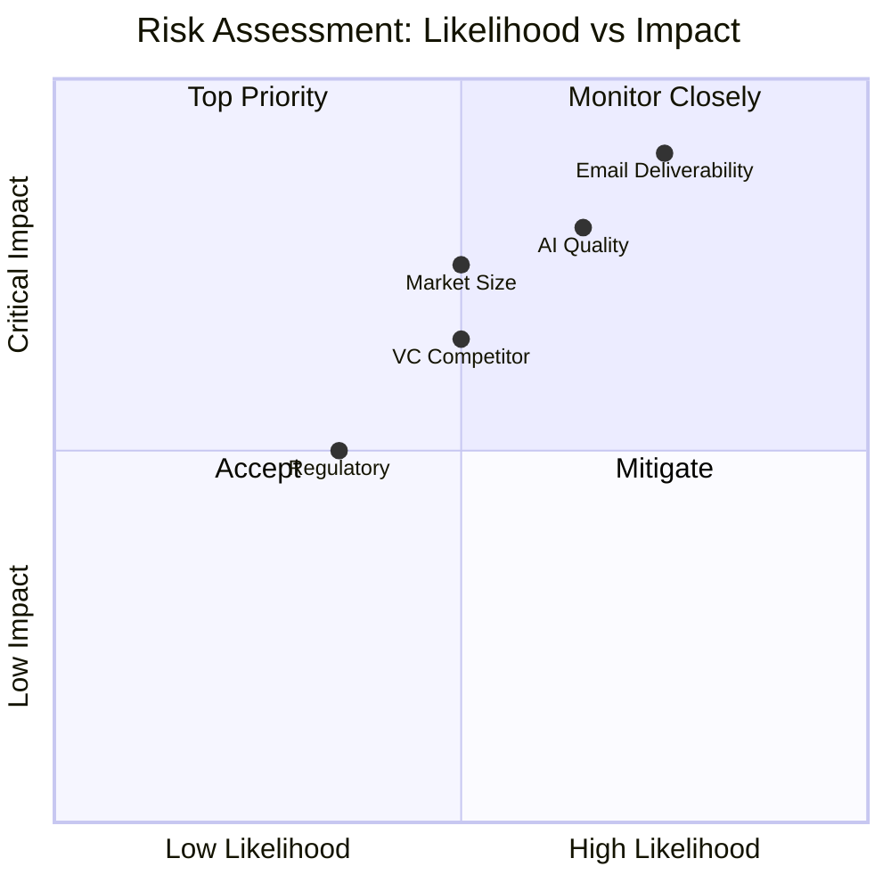
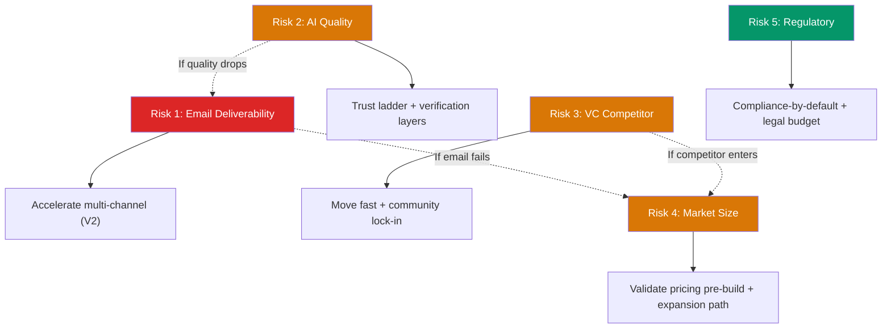

import { Badge } from '@astrojs/starlight/components';

## Risk Matrix

## Top 5 Risks Ranked

| Rank | Risk | Likelihood | Impact | Priority |
|:----:|------|:----------:|:------:|:--------:|
| **1** | Email deliverability collapse | <Badge text="High" variant="danger" /> | <Badge text="Critical" variant="danger" /> | Immediate |
| **2** | AI quality inconsistency | <Badge text="Medium-High" variant="caution" /> | <Badge text="High" variant="danger" /> | Immediate |
| **3** | VC-funded competitor enters niche | <Badge text="Medium" variant="caution" /> | <Badge text="Medium-High" variant="caution" /> | Monitor |
| **4** | Target segment too small or unwilling to pay | <Badge text="Medium" variant="caution" /> | <Badge text="High" variant="danger" /> | Validate early |
| **5** | Regulatory / legal risk | <Badge text="Low-Medium" variant="note" /> | <Badge text="Medium" variant="caution" /> | Plan ahead |

## Risk Interdependencies

See detailed mitigations and kill criteria for each risk in [Mitigations](/spear-gtm/risks/mitigations/).
