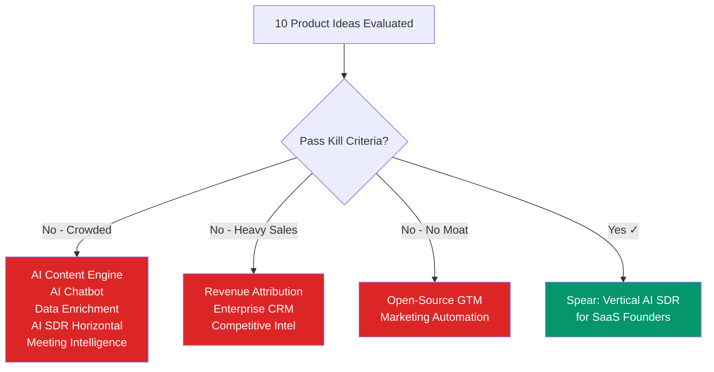

import { Card, CardGrid, Badge } from '@astrojs/starlight/components';

## The Idea Graveyard

Before building Spear, we rigorously evaluated 10 product ideas in the AI-native GTM space. Each was rejected for specific, defensible reasons.

## All 10 Rejected Ideas

| # | Idea | Kill Reason | Key Competitor |
|---|------|-------------|----------------|
| 1 | AI Content Marketing Engine | Crowded + No moat | Jasper, Copy.ai, ChatGPT |
| 2 | AI Chatbot / Conversational Marketing | Time-fillable moat + Crowded | Intercom Fin, Drift, HubSpot |
| 3 | GTM Data Enrichment Platform | Crowded + Moat eroding | Clay ($46M), Apollo (275M+ contacts) |
| 4 | Revenue Attribution Platform | Heavy sales + Nice-to-have for SMBs | Dreamdata, HockeyStack |
| 5 | AI-Native Enterprise CRM | Heavy sales + Capital requirements | Salesforce (150K+ customers) |
| 6 | Horizontal AI SDR Agent | Crowded + Commoditizing | 11x.ai ($50M+), Artisan ($25M) |
| 7 | Open-Source GTM Platform | No moat + Capital mismatch | Twenty.com, Erxes |
| 8 | AI Meeting Intelligence | Time-fillable + Crowded | Gong ($7.2B), Fathom (free) |
| 9 | AI Competitive Intelligence | Heavy sales + Nice-to-have | Klue ($96M), Crayon ($47M) |
| 10 | AI Marketing Automation | Time-fillable moat | HubSpot ($15/mo), Loops.so |

## Kill Criteria Framework

Each idea was evaluated against four fatal flaws:

<CardGrid>
  <Card title="Crowded + No Moat" icon="warning">
    50+ funded competitors, LLM-generated output is commodity, any wrapper around GPT/Claude has zero defensibility. Content marketing, chatbots, and data enrichment all fail here.
  </Card>

  <Card title="Heavy Sales Required" icon="close">
    Requires enterprise sales cycles (6-18 months), SOC 2 compliance, migration tooling. Can't bootstrap into these categories. Enterprise CRM, attribution, and competitive intel all fail here.
  </Card>

  <Card title="Time-Fillable Moat" icon="warning">
    HubSpot or Salesforce could ship a competitive version in one quarter. Meeting intelligence and marketing automation both fail here — incumbents already have the data and distribution.
  </Card>

  <Card title="Capital Mismatch" icon="close">
    Requires $5M+ to build a "whole product." Open-source GTM needs community building over years before monetization, conflicting with bootstrapped constraints.
  </Card>
</CardGrid>

:::tip[The key insight from idea #6]
The horizontal AI SDR market IS crowded. But **verticalized AI SDR for a specific segment** — with segment-specific intelligence that horizontal players can't match — is wide open. That's Spear.
:::
