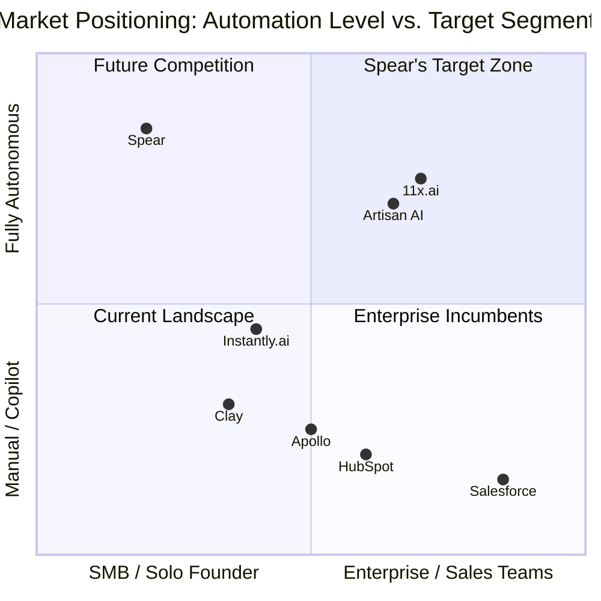

import { Card, CardGrid, Badge, Tabs, TabItem } from '@astrojs/starlight/components';

## Competitive Positioning Map

## The Landscape is Misleading

The consensus view is "AI SDR is crowded with 15+ funded startups." This is a surface-level analysis.

<Tabs>
  <TabItem label="Horizontal AI SDRs" icon="warning">
    **Players**: 11x.ai ($50M+ raised), Artisan AI ($25M raised), AiSDR, Regie.ai, Amplemarket

    **Why they're not competitors**:
    - Target mid-market and enterprise ($800+/mo ACV)
    - Require sales team to sell the product
    - Horizontal positioning means competing on features (which converge) and price (race to bottom)
    - The $200-500/mo SaaS founder segment is **invisible** to VC-backed companies — deal sizes are "too small"
  </TabItem>

  <TabItem label="Tool Stacks" icon="setting">
    **Players**: Clay + Instantly + Apollo (the "DIY stack")

    **Why they're adjacent, not competitive**:
    - Powerful but requires understanding outbound mechanics
    - $500-1,000/mo when fully stacked
    - Significant setup time and ongoing management
    - Built for people who already know sales
    - **Spear is for the people who can't use these tools**
  </TabItem>

  <TabItem label="CRM Giants" icon="star">
    **Players**: HubSpot, Salesforce

    **Why they won't kill Spear** (see [Incumbent Response](/spear-gtm/moat/incumbent-response/)):
    - Incentive misalignment: AI agent cannibalize seat-based revenue
    - Architectural constraint: AI is layered on, not built-in
    - Data disadvantage: can't pool cross-customer data
    - Focus disadvantage: serve 194K+ customers across all segments
  </TabItem>
</Tabs>

## The Real Competitive Map

| Dimension | Horizontal AI SDRs | DIY Tool Stacks | HubSpot/Salesforce | **Spear** |
|-----------|--------------------|-----------------|--------------------|-----------|
| **Target** | Mid-market sales teams | Sales-savvy operators | Everyone | **Technical SaaS founders** |
| **Price** | $800-2,000/mo | $500-1,000/mo + time | $800+/mo | **$199-799/mo** |
| **Setup time** | Days-weeks | Hours-days | Weeks | **30 minutes** |
| **Sales expertise needed** | Some | Significant | Moderate | **None** |
| **Measured by** | Emails sent | Activities completed | Pipeline stages | **Meetings booked** |
| **AI role** | Assistant | Tool | Feature | **The entire product** |

:::note[The ramen shop analogy]
Saying "the AI SDR market is crowded" is like saying "the restaurant market is crowded" when nobody's opened a ramen shop in a neighborhood full of ramen lovers. The niche is unserved.
:::
