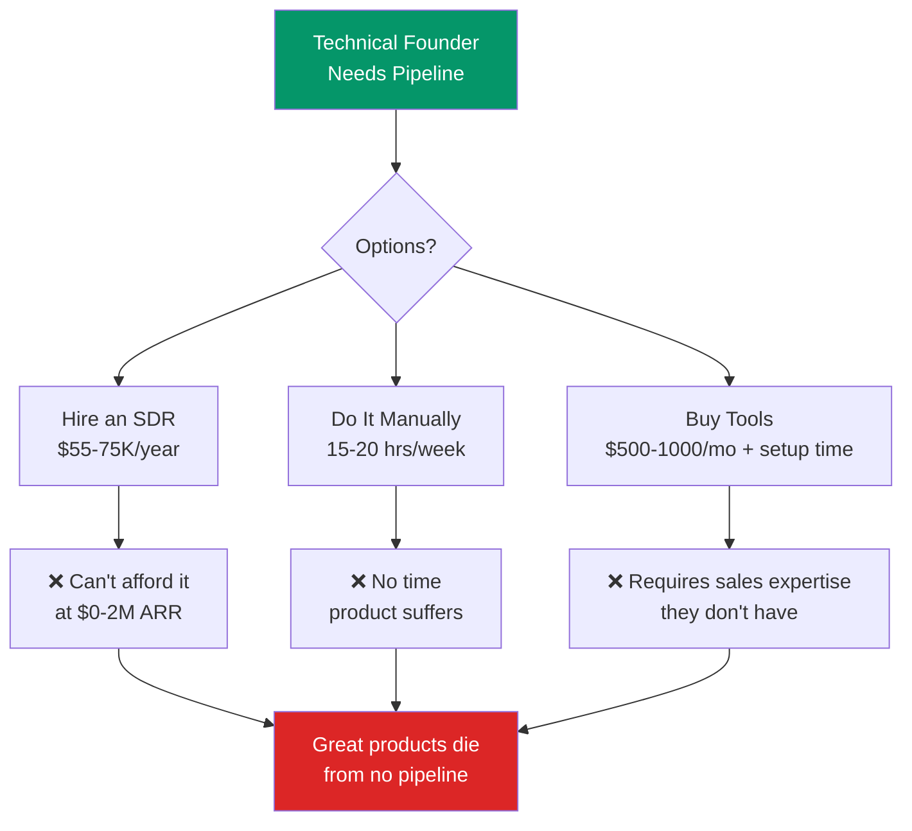

Picture this: you've spent six months building a product people love, your three paying customers came from warm intros, and you've completely exhausted your network. Now what? This page is about the trap almost every technical founder falls into — and why it's not your fault.

## The Pipeline Death Trap

Technical founders at early-stage B2B SaaS companies ($0-$2M ARR) need consistent pipeline to survive. But they face a brutal trilemma:

## The Daily Reality

:::caution[What founders actually say]
- "I spent 3 hours on LinkedIn prospecting and sent 20 emails, got zero responses."
- "I don't know who to target or what to say."
- "I closed my last 3 customers through warm intros but I've exhausted my network."
- "I know I need to do outbound but I keep procrastinating because I don't know how."
:::

## Why Existing Solutions Fail

| Solution | Monthly Cost | Time Required | Works Without Sales Expertise? |
|----------|-------------|---------------|-------------------------------|
| Junior SDR | $5,500-7,000 | Manage them (5+ hrs/week) | Yes, but 3-month ramp |
| Clay + Instantly + Apollo | $500-1,000 | 15-20 hrs/week | **No** — requires understanding outbound mechanics |
| Freelance SDR (Upwork) | $2,000-4,000 | Quality control (3+ hrs/week) | Wildly variable quality |
| LinkedIn Sales Nav + manual | $80 + time | 15-20 hrs/week | **No** — requires writing skill |
| **Spear** | **$199-799** | **&lt;1 hr/week** (review + approve) | **Yes — AI handles everything** |

## The Core Insight

The problem isn't that founders don't want to do outbound. It's that every existing solution assumes they already know how to sell. Clay is powerful but requires understanding of outbound mechanics. Instantly.ai requires domain warming setup, sequence writing, and deliverability management.

**These tools are built for people who already know sales.** Spear is built for people who know how to build products.

:::tip[The math that matters]
An AI agent can now do 80% of what a junior SDR does (research, personalization, sequencing, follow-up) at **1/100th the cost**. This wasn't true 18 months ago. The technology inflection point is now.
:::
