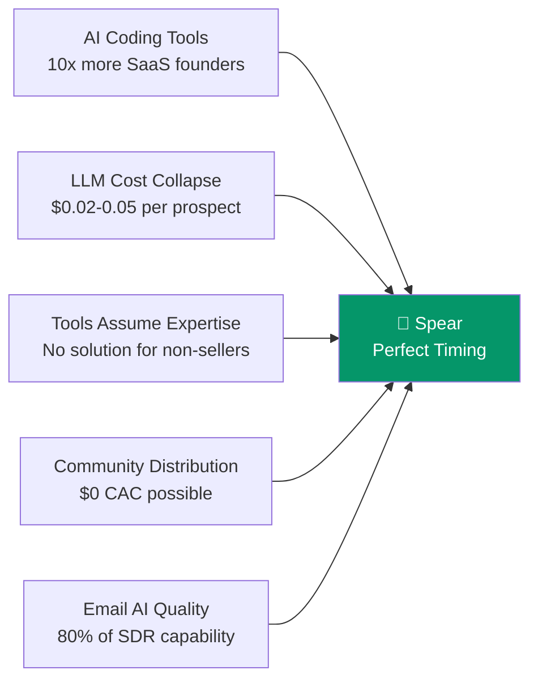

import { Card, CardGrid } from '@astrojs/starlight/components';

## The Convergence Window

Five structural shifts are happening simultaneously, creating a narrow window where Spear is the right product at the right time.

## The Five Forces

<CardGrid>
  <Card title="1. Segment Size is Exploding" icon="rocket">
    AI coding tools have **10x'd the rate** of new SaaS products being created. More technical founders than ever need to learn how to sell. The target market is growing exponentially.
  </Card>

  <Card title="2. Existing Solutions Assume Sales Expertise" icon="warning">
    Clay requires understanding outbound mechanics. Instantly.ai requires domain warming, sequence writing, deliverability management. **These tools are built for people who already know sales.**
  </Card>

  <Card title="3. Cost-to-Capability Gap is Massive" icon="star">
    An AI agent can now do 80% of what a junior SDR does at **1/100th the cost**. Claude Sonnet at $0.003/1K tokens makes prospect evaluation and email writing viable at scale. This wasn't true 18 months ago.
  </Card>

  <Card title="4. Community Distribution is Free" icon="approve-check">
    The target segment congregates in identifiable places: Indie Hackers, r/SaaS, SaaS Twitter/X, Product Hunt, Hacker News. **You can reach them without paid ads or a sales team.**
  </Card>
</CardGrid>

## The ROI Calculation is Trivial

:::tip[The pitch that sells itself]
If Spear delivers 5-10 meetings/month for $300/mo, the ROI vs. hiring an SDR ($6K/mo) or spending 60+ hours/month doing it manually is immediately obvious. No founder needs to be "convinced" of this value prop — they just need to see it work once.
:::

## Why Not Earlier, Why Not Later

| Timing | Problem |
|--------|---------|
| **2 years ago** | LLM quality wasn't good enough for personalized outreach. GPT-3 era emails were obviously AI-generated. |
| **1 year ago** | Tools like Clay were emerging but still required technical setup. The "AI SDR" category was being defined. |
| **Now** | Claude Sonnet 4.6 writes better cold emails than most junior SDRs. Cost per prospect is $0.02-0.05. The technology is ready. |
| **1 year from now** | Category will be defined, incumbents will have AI features, and the first-mover advantage in data compounding will be lost. |
